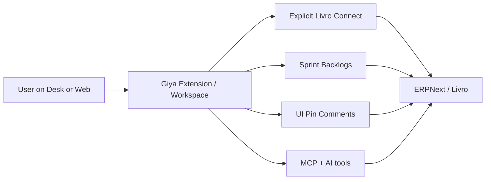

### Hi, I'm Hervey

Software engineer in the Philippines — building AI-assisted product tools, ERPNext/Livro integrations, and modern TypeScript apps with the Wela / Livro R&D team.

## How I ship

## Stats

## Focus

- TypeScript · Next.js · React
- ERPNext / Frappe · Chrome extensions
- AI agents, MCP tools, internal developer tooling

## Selected work

- [Boneless-Bangus](https://github.com/wela-herveyyy/Boneless-Bangus) — AI workspace tooling around Livro ERP
- [JunelAI](https://github.com/wela-herveyyy/JunelAI) — MCP bridge for Livro ERP
- [RND-NEXT-JS-TEMPLETE](https://github.com/wela-herveyyy/RND-NEXT-JS-TEMPLETE) — Next.js starter for R&D

---

Based in the Philippines · Open to interesting TypeScript / AI product problems
